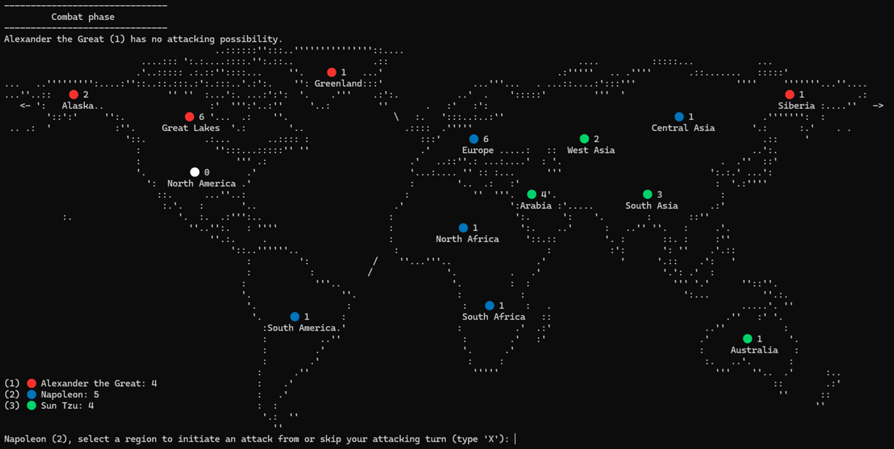

# Conquest

Conquest is a simplified version of the board game Risk, built as a playground for comparing different AI approaches to strategic play: human players, LLM-backed agents, a random-decision-agent and a future reinforcement learning agent, all playable against each other in the same game engine.

Playable in the console with any mix of human players and LLM agents. A `RandomAgent` (uniformly random valid moves) exists as a free, no-API-key baseline opponent and for automated testing.



## Project layout

| File | Contents |
|---|---|
| `game_types.py` | Shared type definitions (`Territories`, `Adjacency`, `Players`) used by both other modules. |
| `conquest.py` | Game engine: board setup, input validation, all game phases, the main loop. |
| `agents.py` | Agent abstract base class (`Agent`) and its implementations (`GeminiAgent`, `RandomAgent`), plus the system prompt and state-description helpers used by LLM agents. |

## Requirements

- Python 3.11+ (uses `X | None` union syntax and `TypedDict`)
- `python-dotenv` and `google-genai` — **for Gemini-backed
  players**. Games with only human and/or `RandomAgent` players need neither
  package nor an API key.

## Running the game

```bash
uv run conquest.py
```

You'll be prompted for the number of players (2–5), each player's name and whether they're AI, if so you will be prompted for a model (`gemini` or `random` for now).

## Game rules

The map has 14 territories, each with a fixed set of neighbours (see `build_adjacency()` in `game.py` for the exact graph). A territory is either unclaimed or owned by one player, and holds some number of units.

**Setup:** each player is randomly assigned one starting territory. Players then take turns placing one unit per round (in territories they own, or unclaimed territories adjacent to ones they own) for a number of rounds determined by how many starting units players get based on player count (2 players → 7 units, down to 5 players → 3 units).

After setup, the game repeats three phases each round until one player remains:

1. **Combat:** Each player able to attack either launches one attack (from a territory they own with ≥2 units, into an adjacent enemy territory) or skips. This repeats in rounds until every player has skipped or run out of attacking options in the same round. Battles resolve one dice roll at a time (attacker vs. defender, defender wins ties); a battle ends when the defender is wiped out or the attacker is down to 1 unit, or the attacker chooses to call it off. Conquering a territory requires choosing how many units to move in (leaving at least 1 behind).
2. **Repositioning:** Each player may move units between their own adjacent territories, or into adjacent unclaimed territories to occupy them, leaving at least 1 unit behind in the source territory each time. Agents are capped at 3 moves per turn to avoid infinite back and forth movement; humans can move until they choose to stop.
3. **Reinforcement:** Each player receives new units equal to their current territory count, and must allocate all of them across their own territories before ending their turn.

A player is eliminated once they control zero territories. The game ends when only one player remains.

<!-- ## Architecture: the `Agent` interface

Every decision in the game — where to place a unit, whether to attack, which territory to move into, how many units to commit, whether to continue an attack — reduces to one of three primitives, defined as abstract methods on `Agent` in `agents.py`:

- `choose_territory(...)` — pick one territory name from a list of valid options (optionally with a "skip" choice, e.g. to end an attacking turn).
- `choose_unit_count(...)` — pick a whole number of units within a range.
- `choose_yes_no(...)` — answer a yes/no question (currently only used for "continue attacking?").

`conquest.py` never talks to a model or a human directly — every phase function computes the valid options itself (e.g. `get_attacker_options`, `get_reposition_destination_options`) and then dispatches to either a `human_*` function (console `input()` prompts with their own validation loops) or an `agent_*` function (calls the relevant `Agent` method with the precomputed options).

This split is what makes it straightforward to add new agent types: a new class only needs to implement the three `Agent` methods, using whatever mechanism it likes internally (a different LLM API, a trained policy network, a hand-written heuristic). The game engine, input validation, and rules enforcement stay untouched.

### `GeminiAgent`

Wraps the Gemini Interactions API. Each player using this agent has a persistent `interaction_id`, so their agent has memory of its own game across calls (`players[player_id]["interaction_id"]`). Decisions are constrained via JSON schemas (`response_format`) so responses are always structurally valid; the game engine still validates the chosen value against the actual current options, since a schema only guarantees shape, not game-legality.

Each player also accumulates a `game_events` log (`players[player_id]["game_events"]`) of everything that happened since their last turn, via `broadcast_event()`, which is included in their next prompt and then cleared — this is what lets an agent "catch up" on what opponents did while it wasn't acting.

### `RandomAgent`

Implements the same three methods with `random.choice` / `random.randint`. Used as a free baseline for testing game logic end-to-end without spending API credits, and as a trivial opponent.

## Roadmap

- Additional LLM-backed agents (other providers/models) implementing the same `Agent` interface.
- A reinforcement-learning agent trained via self-play, also implementing `Agent`, to be benchmarked against the LLM and random agents.
- Some way to run many games automatically (headless, no console prompts) and tally win rates per agent type, once there's more than one non-random agent to compare.

## Known limitations

- The console UI is the only interface right now; there's no way to run games programmatically without answering `input()` prompts for any human players.
- `GeminiAgent`'s use of `client.interactions.create(...)` and related response fields hasn't been independently verified against current Gemini
  SDK documentation — if the SDK's shape changes, this is the method to revisit.
- No persistence: game state, logs, and agent memory (`interaction_id`) all live only in memory for the duration of one `python game.py` run. -->


